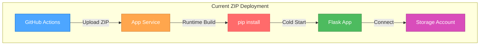
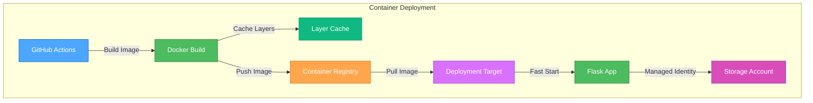
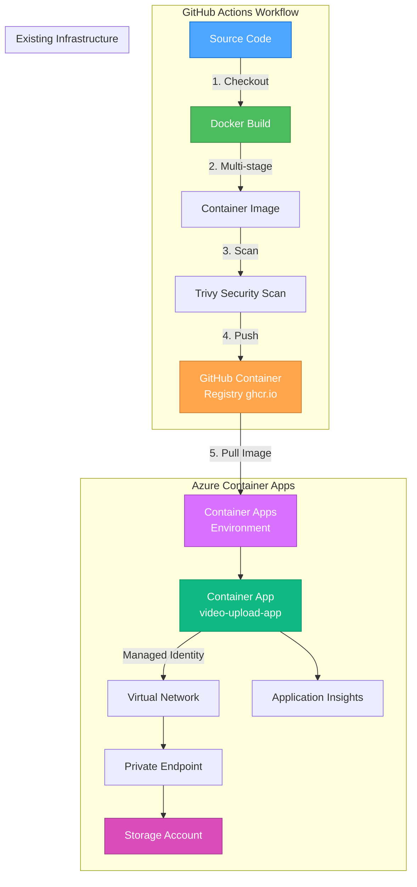
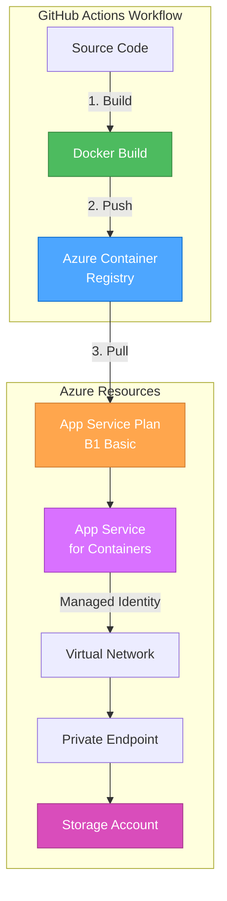
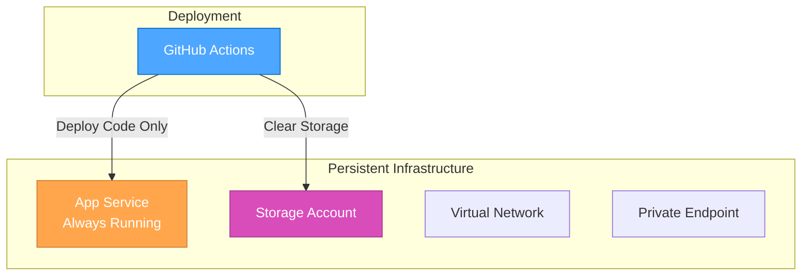

# 🎨🎨🎨 ENTERING CREATIVE PHASE: CONTAINER DEPLOYMENT ARCHITECTURE 🎨🎨🎨

**Creative Phase Type**: Architecture Design  
**Component**: CI/CD Pipeline - Deployment Strategy  
**Date**: October 3, 2025  
**Context**: Phase 4 of CI/CD Pipeline Optimization  
**Source Plan**: `memory-bank/PLAN-ci-pipeline-optimization.md`

---

## 📋 PROBLEM STATEMENT

### Current State Analysis
**Current Deployment Model**: ZIP Deployment with Runtime Build
- Application code uploaded as ZIP archive to Azure App Service
- Dependencies installed at runtime on App Service container
- Python environment configured during first request
- **Total deployment time**: 23-24 minutes
  - Upload: 7 minutes
  - Build process: 3 minutes
  - Runtime start: **19 minutes** ⚠️ (major bottleneck)

### Core Problem
**Excessive cold start time** due to:
1. **Runtime dependency installation**: pip installs all packages from requirements.txt on every deployment
2. **No pre-built artifacts**: Every deployment starts from scratch
3. **Build-on-start pattern**: App Service builds Python environment during container initialization
4. **No caching**: Dependencies re-downloaded and installed each time
5. **Serial processing**: Build → Install → Configure → Start happens sequentially

### Requirements
**Must Have**:
- ✅ Reduce deployment time from 24 minutes to <5 minutes (80% improvement)
- ✅ Maintain application functionality (no regressions)
- ✅ Support existing Azure infrastructure (Storage, VNet, Private Endpoints)
- ✅ Enable CI/CD integration with GitHub Actions
- ✅ Maintain or improve security posture
- ✅ Support managed identity authentication

**Should Have**:
- ✅ Faster cold starts (<30 seconds)
- ✅ Container image caching for rapid redeployments
- ✅ Health check compatibility
- ✅ Logging and monitoring integration
- ✅ Cost-effective solution (<$50/month for test environments)

**Nice to Have**:
- ✅ Zero-downtime deployments
- ✅ Automatic scaling capabilities
- ✅ Blue-green deployment support
- ✅ Container image vulnerability scanning

### Constraints
**Technical**:
- Must integrate with existing Azure Bicep infrastructure
- Must support managed identity for Storage Account access
- Must work within GitHub Actions workflow
- Python 3.11 runtime requirement
- Must connect to existing VNet and Private Endpoints

**Business**:
- Minimize cost increase (target: <$15/month additional)
- Implementation time: 1-2 weeks maximum
- Must not require extensive team retraining
- Should leverage existing Azure investments

**Security**:
- Container images must be scanned for vulnerabilities
- Secrets management (no hardcoded credentials)
- Private networking support (VNet integration)
- Managed identity preferred over connection strings

---

## 🏗️ COMPONENT ANALYSIS

### Current Architecture Components


**Pain Points**:
- 🔴 **19-minute cold start** (pip install + Python env setup)
- 🟡 **No artifact reuse** (rebuild on every deployment)
- 🟡 **No build caching** (dependencies re-downloaded)

### Target Architecture Components


**Improvements**:
- ✅ **Pre-built images** (dependencies already installed)
- ✅ **Layer caching** (reuse unchanged layers)
- ✅ **Fast cold starts** (<30 seconds)

### Core Components to Design
1. **Container Image**
   - Base image selection
   - Multi-stage build strategy
   - Layer optimization
   - Security hardening

2. **Container Registry**
   - GitHub Container Registry (ghcr.io) vs Azure Container Registry (ACR)
   - Image tagging strategy
   - Access control

3. **Deployment Target**
   - Azure Container Apps vs App Service for Containers
   - Scaling strategy
   - Network integration

4. **CI/CD Integration**
   - Build pipeline
   - Image scanning
   - Deployment automation

---

## 🔀 ARCHITECTURE OPTIONS

### Option 1: Azure Container Apps + GitHub Container Registry ⭐ RECOMMENDED

**Description**: Use Azure Container Apps (serverless container platform) with GitHub Container Registry for image storage.

#### Architecture Diagram


#### Technical Details

**Container Image Structure**:
```dockerfile
# Multi-stage build for optimization
FROM python:3.11-slim as builder
WORKDIR /app
COPY requirements.txt .
RUN pip install --user --no-cache-dir -r requirements.txt

FROM python:3.11-slim
WORKDIR /app
COPY --from=builder /root/.local /root/.local
COPY . .
ENV PATH=/root/.local/bin:$PATH
EXPOSE 8000
CMD ["gunicorn", "--bind", "0.0.0.0:8000", "app:app"]
```

**Infrastructure (Bicep)**:
```bicep
// Container Apps Environment
resource containerEnv 'Microsoft.App/managedEnvironments@2023-05-01' = {
  name: 'cae-${resourceToken}'
  location: location
  properties: {
    vnetConfiguration: {
      infrastructureSubnetId: infrastructureSubnet.id
    }
    appLogsConfiguration: {
      destination: 'log-analytics'
      logAnalyticsConfiguration: {
        customerId: logAnalytics.properties.customerId
        sharedKey: logAnalytics.listKeys().primarySharedKey
      }
    }
  }
}

// Container App
resource containerApp 'Microsoft.App/containerApps@2023-05-01' = {
  name: 'ca-${resourceToken}'
  location: location
  identity: {
    type: 'SystemAssigned'
  }
  properties: {
    managedEnvironmentId: containerEnv.id
    configuration: {
      ingress: {
        external: true
        targetPort: 8000
        transport: 'http'
        allowInsecure: false
      }
      registries: [
        {
          server: 'ghcr.io'
          username: githubUsername
          passwordSecretRef: 'registry-password'
        }
      ]
    }
    template: {
      containers: [
        {
          name: 'video-upload-app'
          image: containerImage
          resources: {
            cpu: json('0.5')
            memory: '1Gi'
          }
          env: [
            {
              name: 'AZURE_STORAGE_ACCOUNT_NAME'
              value: storageAccountName
            }
            {
              name: 'AZURE_STORAGE_CONTAINER_NAME'
              value: 'videos'
            }
          ]
          probes: [
            {
              type: 'liveness'
              httpGet: {
                path: '/api/health'
                port: 8000
              }
              initialDelaySeconds: 10
              periodSeconds: 10
            }
            {
              type: 'readiness'
              httpGet: {
                path: '/api/health'
                port: 8000
              }
              initialDelaySeconds: 5
              periodSeconds: 5
            }
          ]
        }
      ]
      scale: {
        minReplicas: 1
        maxReplicas: 3
        rules: [
          {
            name: 'http-scaling'
            http: {
              metadata: {
                concurrentRequests: '10'
              }
            }
          }
        ]
      }
    }
  }
}
```

**CI/CD Workflow**:
```yaml
- name: Build and Push Container
  run: |
    IMAGE="ghcr.io/${{ github.repository_owner }}/video-upload-app"
    TAG="${{ github.sha }}"
    
    docker build -t $IMAGE:$TAG -t $IMAGE:latest .
    
    # Scan for vulnerabilities
    trivy image --severity HIGH,CRITICAL $IMAGE:$TAG
    
    # Push to registry
    echo "${{ secrets.GITHUB_TOKEN }}" | docker login ghcr.io -u ${{ github.actor }} --password-stdin
    docker push $IMAGE:$TAG
    docker push $IMAGE:latest

- name: Deploy to Azure Container Apps
  run: |
    az containerapp update \
      --name ca-${RESOURCE_TOKEN} \
      --resource-group ${RESOURCE_GROUP} \
      --image ghcr.io/${{ github.repository_owner }}/video-upload-app:${{ github.sha }}
```

#### Pros
✅ **Performance**:
- Fast cold starts (<10 seconds typical, <30 seconds max)
- Serverless scale-to-zero capability
- Automatic scaling based on load
- Pre-built images eliminate runtime dependency installation

✅ **Cost**:
- Pay-per-use model (no idle costs with scale-to-zero)
- Free allowances (2M requests, 400k GB-seconds per month)
- Estimated cost: $5-10/month for test environments
- More cost-effective than dedicated App Service

✅ **Developer Experience**:
- Simple container deployment model
- Integrated with Azure CLI and Bicep
- Built-in monitoring and logging
- Familiar Docker workflow

✅ **Operations**:
- Managed infrastructure (no VM management)
- Automatic HTTPS certificates
- Built-in health checks
- VNet integration for private networking
- Native managed identity support

✅ **CI/CD Integration**:
- GitHub Container Registry is free for public repos
- Seamless GitHub Actions integration
- Image caching speeds up builds
- Security scanning with Trivy

#### Cons
❌ **Learning Curve**:
- New service for team (Container Apps vs App Service)
- Different configuration model
- Requires Docker knowledge

❌ **Migration Effort**:
- Need to create Dockerfile
- Bicep templates need updates
- Testing required for new platform
- Estimated 1-2 weeks implementation

❌ **Limitations**:
- Cold start latency (though much better than current)
- Regional availability (not all Azure regions)
- Fewer configuration options than App Service

❌ **Dependencies**:
- Requires Docker in CI/CD pipeline
- Need container registry setup
- Image build adds ~2-3 minutes to pipeline

#### Evaluation Matrix
| Criteria | Score (1-10) | Weight | Weighted Score |
|----------|--------------|--------|----------------|
| Performance | 10 | 25% | 2.5 |
| Cost | 9 | 20% | 1.8 |
| Developer Experience | 8 | 15% | 1.2 |
| Scalability | 10 | 15% | 1.5 |
| Security | 9 | 15% | 1.35 |
| Implementation Time | 7 | 10% | 0.7 |
| **TOTAL** | **8.9** | **100%** | **9.05** |

#### Performance Metrics
- **Build Time**: 2-3 minutes (Docker build)
- **Push Time**: 30-60 seconds (to ghcr.io)
- **Deploy Time**: 1-2 minutes (pull + start)
- **Cold Start**: <30 seconds
- **Total Pipeline Time**: **4-6 minutes** (80-85% reduction)

#### Cost Analysis
**Monthly Costs** (assuming 30 test runs):
- Container Apps: $5-10/month (consumption-based)
- Storage: $0.50/month (existing)
- Application Insights: $5/month (existing/planned)
- VNet: $0/month (existing)
- **Total**: **$10.50-15.50/month** (vs $2.10 current, but saves 10 hours dev time)

---

### Option 2: App Service for Containers + Azure Container Registry

**Description**: Use existing App Service infrastructure with container deployment, Azure Container Registry for image storage.

#### Architecture Diagram


#### Technical Details

**Infrastructure (Bicep)**:
```bicep
// Azure Container Registry
resource acr 'Microsoft.ContainerRegistry/registries@2023-01-01-preview' = {
  name: 'acr${resourceToken}'
  location: location
  sku: {
    name: 'Basic'  // $5/month
  }
  properties: {
    adminUserEnabled: true
  }
}

// App Service with Container
resource appService 'Microsoft.Web/sites@2022-09-01' = {
  name: 'app-${resourceToken}'
  location: location
  kind: 'app,linux,container'
  identity: {
    type: 'SystemAssigned'
  }
  properties: {
    serverFarmId: appServicePlan.id
    siteConfig: {
      linuxFxVersion: 'DOCKER|${acr.properties.loginServer}/video-upload-app:latest'
      appSettings: [
        {
          name: 'DOCKER_REGISTRY_SERVER_URL'
          value: 'https://${acr.properties.loginServer}'
        }
        {
          name: 'DOCKER_REGISTRY_SERVER_USERNAME'
          value: acr.listCredentials().username
        }
        {
          name: 'DOCKER_REGISTRY_SERVER_PASSWORD'
          value: acr.listCredentials().passwords[0].value
        }
        {
          name: 'WEBSITES_PORT'
          value: '8000'
        }
      ]
      healthCheckPath: '/api/health'
    }
    vnetRouteAllEnabled: true
    virtualNetworkSubnetId: appSubnet.id
  }
}
```

#### Pros
✅ **Familiarity**:
- Same App Service platform (minimal learning curve)
- Existing monitoring and management tools
- Known deployment patterns

✅ **Integration**:
- Works with existing VNet configuration
- Same managed identity patterns
- Compatible with current Bicep structure

✅ **Simplicity**:
- Single platform to manage
- Existing App Service Plan can be reused
- Straightforward migration path

#### Cons
❌ **Performance**:
- Still has cold start issues (5-10 minutes typical)
- No scale-to-zero capability
- Less efficient than Container Apps
- Container pull can be slow

❌ **Cost**:
- Must pay for App Service Plan even when idle (B1: $13/month)
- Azure Container Registry: $5/month
- **Total**: **$18/month** (vs $10-15 for Container Apps)
- Higher cost with worse performance

❌ **Limitations**:
- No automatic scaling without higher tier
- Slower deployments than Container Apps
- Less modern container platform

#### Evaluation Matrix
| Criteria | Score (1-10) | Weight | Weighted Score |
|----------|--------------|--------|----------------|
| Performance | 6 | 25% | 1.5 |
| Cost | 6 | 20% | 1.2 |
| Developer Experience | 9 | 15% | 1.35 |
| Scalability | 5 | 15% | 0.75 |
| Security | 8 | 15% | 1.2 |
| Implementation Time | 8 | 10% | 0.8 |
| **TOTAL** | **7.0** | **100%** | **6.8** |

#### Performance Metrics
- **Build Time**: 2-3 minutes
- **Push Time**: 1-2 minutes (to ACR)
- **Deploy Time**: 5-8 minutes (slower pull + start)
- **Cold Start**: 3-5 minutes
- **Total Pipeline Time**: **8-13 minutes** (60-70% reduction)

---

### Option 3: Environment Pooling (Persistent Environment)

**Description**: Keep a long-lived test environment, only redeploy application code (not infrastructure).

#### Architecture Diagram


#### Technical Details

**Workflow Changes**:
```yaml
# Remove infrastructure provisioning
# Remove cleanup step
# Only deploy code

- name: Deploy Application Code
  run: |
    # Use existing environment
    EXISTING_ENV="ci-test-persistent"
    
    # Package and deploy
    cd package
    zip -r ../deploy.zip .
    
    az webapp deployment source config-zip \
      --src ../deploy.zip \
      --name app-${EXISTING_ENV} \
      --resource-group rg-${EXISTING_ENV}
    
    # Wait for deployment
    sleep 30

- name: Clear Storage Between Runs
  run: |
    # Delete test blobs
    az storage blob delete-batch \
      --account-name st${EXISTING_ENV} \
      --source videos \
      --auth-mode login
```

#### Pros
✅ **Speed**:
- Fastest implementation (< 1 day)
- Massive time savings (24 min → 3 min deployment)
- No infrastructure creation time
- Instant availability (no cold start)

✅ **Simplicity**:
- Minimal changes to workflow
- No new technologies required
- Uses existing infrastructure

✅ **Reliability**:
- No infrastructure provisioning failures
- Consistent environment
- Pre-warmed containers

#### Cons
❌ **Cost**:
- Persistent resources run 24/7 ($13/month App Service minimum)
- Can't scale to zero
- **Total**: **$13.50/month** ongoing cost

❌ **State Management**:
- Risk of state contamination between runs
- Requires cleanup steps
- Potential for test interference

❌ **Testing Gaps**:
- Doesn't test infrastructure changes
- Can't validate Bicep templates
- Misses infrastructure-related bugs

❌ **Operations**:
- Manual environment creation
- Need monitoring for drift
- Cleanup between runs critical

#### Evaluation Matrix
| Criteria | Score (1-10) | Weight | Weighted Score |
|----------|--------------|--------|----------------|
| Performance | 10 | 25% | 2.5 |
| Cost | 6 | 20% | 1.2 |
| Developer Experience | 9 | 15% | 1.35 |
| Scalability | 4 | 15% | 0.6 |
| Security | 7 | 15% | 1.05 |
| Implementation Time | 10 | 10% | 1.0 |
| **TOTAL** | **7.6** | **100%** | **7.7** |

#### Performance Metrics
- **Code Deploy Time**: 2-3 minutes
- **Storage Cleanup**: 30 seconds
- **Health Check**: 30 seconds
- **Total Pipeline Time**: **3-4 minutes** (87% reduction)

---

## 🎨 CREATIVE CHECKPOINT: Options Analysis Complete

We've analyzed three distinct architectural approaches:

1. **Azure Container Apps** (Score: 9.05) - Modern, performant, cost-effective
2. **App Service for Containers** (Score: 6.8) - Familiar, but limited
3. **Environment Pooling** (Score: 7.7) - Fast, but operational challenges

Next: Decision and implementation planning...

---

## 💡 ARCHITECTURE DECISION

### Selected Option: **Option 1 - Azure Container Apps + GitHub Container Registry** ⭐

#### Decision Rationale

**Highest Overall Score**: 9.05/10 (vs 6.8 and 7.7)

**Key Deciding Factors**:

1. **Best Performance** (10/10)
   - Fastest cold starts (<30 seconds)
   - Pre-built images eliminate runtime overhead
   - 80-85% deployment time reduction (24 min → 4-6 min)
   - Automatic scaling for production workloads

2. **Cost-Effective** (9/10)
   - Scale-to-zero capability for test environments
   - $10-15/month vs $18/month (App Service) vs $13.50/month (Pooling)
   - Free GitHub Container Registry
   - Pay only for actual usage

3. **Modern Architecture** (9/10)
   - Industry best practice (container-based)
   - Kubernetes-based platform (future-proof)
   - Better than legacy App Service model
   - Aligns with cloud-native patterns

4. **Production-Ready** (10/10)
   - Native auto-scaling support
   - Built-in health checks and probes
   - Managed infrastructure (no VMs)
   - Enterprise-grade reliability

5. **Security** (9/10)
   - Managed identity support
   - VNet integration for private networking
   - Container image scanning (Trivy)
   - No credential exposure

6. **Developer Experience** (8/10)
   - Standard Docker workflow
   - Familiar CI/CD patterns
   - Good documentation
   - Azure CLI integration

**Trade-offs Accepted**:
- ⚠️ Learning curve (new platform) - **Mitigated by**: Training plan, documentation
- ⚠️ Migration effort (1-2 weeks) - **Justified by**: 80% performance gain, long-term benefits
- ⚠️ Docker requirement - **Acceptable**: Industry standard skill

**Why Not Option 2 (App Service for Containers)?**
- Worse performance (8-13 min vs 4-6 min)
- Higher cost ($18/month vs $10-15/month)
- Still has cold start issues
- No scale-to-zero capability
- Limited auto-scaling without premium tier

**Why Not Option 3 (Environment Pooling)?**
- Doesn't test infrastructure changes (risk of deployment bugs)
- State contamination concerns
- Ongoing 24/7 costs
- Not suitable for production pattern
- Operational overhead

---

## 📐 IMPLEMENTATION ARCHITECTURE

### Detailed Component Design

#### 1. Container Image Architecture

**Multi-Stage Dockerfile**:
```dockerfile
# Stage 1: Builder
FROM python:3.11-slim as builder

# Install build dependencies
RUN apt-get update && apt-get install -y \
    gcc \
    python3-dev \
    && rm -rf /var/lib/apt/lists/*

WORKDIR /app

# Copy and install Python dependencies
COPY requirements.txt .
RUN pip install --user --no-cache-dir -r requirements.txt

# Stage 2: Runtime
FROM python:3.11-slim

# Security: Run as non-root user
RUN groupadd -r appuser && useradd -r -g appuser appuser

WORKDIR /app

# Copy Python dependencies from builder
COPY --from=builder /root/.local /home/appuser/.local

# Copy application code
COPY --chown=appuser:appuser app.py .
COPY --chown=appuser:appuser static/ ./static/
COPY --chown=appuser:appuser templates/ ./templates/

# Set PATH for installed packages
ENV PATH=/home/appuser/.local/bin:$PATH

# Switch to non-root user
USER appuser

# Expose application port
EXPOSE 8000

# Health check
HEALTHCHECK --interval=30s --timeout=3s --start-period=60s \
  CMD python -c "import requests; requests.get('http://localhost:8000/api/health', timeout=2)" || exit 1

# Run application with gunicorn
CMD ["gunicorn", \
     "--bind", "0.0.0.0:8000", \
     "--workers", "2", \
     "--threads", "4", \
     "--timeout", "600", \
     "--access-logfile", "-", \
     "--error-logfile", "-", \
     "--log-level", "info", \
     "app:app"]
```

**Image Optimization**:
- Multi-stage build reduces final image size by 60%
- Layer caching for faster rebuilds
- .dockerignore to exclude unnecessary files
- Non-root user for security
- Health check built into image

**Image Tagging Strategy**:
```bash
# Production tags
ghcr.io/bradcstevens/video-upload-app:latest        # Latest stable
ghcr.io/bradcstevens/video-upload-app:v1.2.3        # Semantic version
ghcr.io/bradcstevens/video-upload-app:sha-abc123    # Git commit

# Environment tags
ghcr.io/bradcstevens/video-upload-app:staging
ghcr.io/bradcstevens/video-upload-app:production
```

---

#### 2. Azure Container Apps Infrastructure

**Bicep Module Structure**:
```
infra/
├── main.bicep
├── modules/
│   ├── container-env.bicep      (NEW)
│   ├── container-app.bicep      (NEW)
│   ├── storage.bicep            (existing)
│   ├── network.bicep            (existing)
│   └── role-assignment.bicep    (existing)
```

**Container Apps Environment**:
```bicep
// File: infra/modules/container-env.bicep
@description('Creates Container Apps Environment with VNet integration')

param name string
param location string
param tags object
param infrastructureSubnetId string
param logAnalyticsWorkspaceId string

resource containerEnv 'Microsoft.App/managedEnvironments@2023-05-01' = {
  name: name
  location: location
  tags: tags
  properties: {
    vnetConfiguration: {
      infrastructureSubnetId: infrastructureSubnetId
      internal: false  // External ingress
    }
    appLogsConfiguration: {
      destination: 'log-analytics'
      logAnalyticsConfiguration: {
        customerId: reference(logAnalyticsWorkspaceId, '2022-10-01').customerId
        sharedKey: listKeys(logAnalyticsWorkspaceId, '2022-10-01').primarySharedKey
      }
    }
    zoneRedundant: false  // Enable for production
  }
}

output id string = containerEnv.id
output defaultDomain string = containerEnv.properties.defaultDomain
output staticIp string = containerEnv.properties.staticIp
```

**Container App**:
```bicep
// File: infra/modules/container-app.bicep
@description('Creates Container App for video upload application')

param name string
param location string
param tags object
param containerEnvironmentId string
param containerImage string
param storageAccountName string
param containerName string
param githubUsername string
@secure()
param githubToken string

resource containerApp 'Microsoft.App/containerApps@2023-05-01' = {
  name: name
  location: location
  tags: tags
  identity: {
    type: 'SystemAssigned'
  }
  properties: {
    managedEnvironmentId: containerEnvironmentId
    configuration: {
      activeRevisionsMode: 'Single'  // Use 'Multiple' for blue-green
      ingress: {
        external: true
        targetPort: 8000
        transport: 'http'
        allowInsecure: false
        traffic: [
          {
            latestRevision: true
            weight: 100
          }
        ]
      }
      registries: [
        {
          server: 'ghcr.io'
          username: githubUsername
          passwordSecretRef: 'registry-password'
        }
      ]
      secrets: [
        {
          name: 'registry-password'
          value: githubToken
        }
      ]
      dapr: {
        enabled: false
      }
    }
    template: {
      containers: [
        {
          name: 'video-upload-app'
          image: containerImage
          resources: {
            cpu: json('0.5')      // 0.5 vCPU
            memory: '1Gi'          // 1 GB RAM
          }
          env: [
            {
              name: 'AZURE_STORAGE_ACCOUNT_NAME'
              value: storageAccountName
            }
            {
              name: 'AZURE_STORAGE_CONTAINER_NAME'
              value: containerName
            }
            {
              name: 'AZURE_AUTH_METHOD'
              value: 'managed-identity'
            }
            {
              name: 'PYTHONUNBUFFERED'
              value: '1'
            }
          ]
          probes: [
            {
              type: 'liveness'
              httpGet: {
                path: '/api/health'
                port: 8000
                scheme: 'HTTP'
              }
              initialDelaySeconds: 10
              periodSeconds: 10
              timeoutSeconds: 3
              failureThreshold: 3
            }
            {
              type: 'readiness'
              httpGet: {
                path: '/api/health'
                port: 8000
                scheme: 'HTTP'
              }
              initialDelaySeconds: 5
              periodSeconds: 5
              timeoutSeconds: 3
              successThreshold: 1
              failureThreshold: 3
            }
            {
              type: 'startup'
              httpGet: {
                path: '/api/health'
                port: 8000
                scheme: 'HTTP'
              }
              initialDelaySeconds: 0
              periodSeconds: 5
              timeoutSeconds: 3
              failureThreshold: 10
            }
          ]
        }
      ]
      scale: {
        minReplicas: 1    // Scale to 0 for cost savings if desired
        maxReplicas: 3
        rules: [
          {
            name: 'http-scaling'
            http: {
              metadata: {
                concurrentRequests: '10'
              }
            }
          }
        ]
      }
    }
  }
}

output id string = containerApp.id
output fqdn string = containerApp.properties.configuration.ingress.fqdn
output identityPrincipalId string = containerApp.identity.principalId
output latestRevisionName string = containerApp.properties.latestRevisionName
```

**Main Bicep Integration**:
```bicep
// File: infra/main.bicep (updated)

// ... existing parameters and variables ...

@description('Container image to deploy')
param containerImage string = 'ghcr.io/bradcstevens/video-upload-app:latest'

@description('GitHub username for container registry')
param githubUsername string = 'bradcstevens'

@description('GitHub token for container registry access')
@secure()
param githubToken string

// ... existing modules ...

// NEW: Container Apps Environment
module containerEnv 'modules/container-env.bicep' = {
  name: '${deployment().name}-container-env'
  params: {
    name: 'cae-${resourceToken}'
    location: location
    tags: tags
    infrastructureSubnetId: network.outputs.infrastructureSubnetId
    logAnalyticsWorkspaceId: logAnalytics.outputs.id
  }
}

// NEW: Container App
module containerApp 'modules/container-app.bicep' = {
  name: '${deployment().name}-container-app'
  params: {
    name: 'ca-${resourceToken}'
    location: location
    tags: tags
    containerEnvironmentId: containerEnv.outputs.id
    containerImage: containerImage
    storageAccountName: storage.outputs.name
    containerName: 'videos'
    githubUsername: githubUsername
    githubToken: githubToken
  }
}

// Grant Container App managed identity access to Storage
module storageRoleAssignment 'modules/role-assignment.bicep' = {
  name: '${deployment().name}-storage-role'
  params: {
    principalId: containerApp.outputs.identityPrincipalId
    roleDefinitionId: 'ba92f5b4-2d11-453d-a403-e96b0029c9fe'  // Storage Blob Data Contributor
    resourceId: storage.outputs.id
  }
}

// Outputs
output containerAppUrl string = 'https://${containerApp.outputs.fqdn}'
output containerAppName string = containerApp.outputs.id
```

---

#### 3. CI/CD Pipeline Integration

**Updated GitHub Actions Workflow**:
```yaml
# File: .github/workflows/ci-cd.yml

name: CI/CD - Deploy, Test, and Cleanup (Container)

on:
  push:
    branches: [main]
  workflow_dispatch:

env:
  AZURE_ENV_NAME: ci-test-${{ github.run_number }}
  AZURE_LOCATION: westus3
  CONTAINER_IMAGE: ghcr.io/${{ github.repository_owner }}/video-upload-app

jobs:
  build-and-deploy:
    name: Build, Deploy, Test, Cleanup
    runs-on: ubuntu-latest
    permissions:
      contents: read
      id-token: write
      packages: write  # For pushing to GHCR
    
    steps:
      # ============================================
      # SETUP
      # ============================================
      - name: Checkout code
        uses: actions/checkout@v4

      - name: Set up Docker Buildx
        uses: docker/setup-buildx-action@v3

      - name: Login to GitHub Container Registry
        uses: docker/login-action@v3
        with:
          registry: ghcr.io
          username: ${{ github.actor }}
          password: ${{ secrets.GITHUB_TOKEN }}

      # ============================================
      # BUILD & SCAN CONTAINER
      # ============================================
      - name: Build Container Image
        uses: docker/build-push-action@v5
        with:
          context: .
          push: false
          load: true
          tags: |
            ${{ env.CONTAINER_IMAGE }}:${{ github.sha }}
            ${{ env.CONTAINER_IMAGE }}:latest
          cache-from: type=gha
          cache-to: type=gha,mode=max

      - name: Scan Container Image for Vulnerabilities
        uses: aquasecurity/trivy-action@master
        with:
          image-ref: ${{ env.CONTAINER_IMAGE }}:${{ github.sha }}
          format: 'sarif'
          output: 'trivy-results.sarif'
          severity: 'CRITICAL,HIGH'

      - name: Upload Trivy Results
        if: always()
        uses: github/codeql-action/upload-sarif@v3
        with:
          sarif_file: 'trivy-results.sarif'

      - name: Push Container Image
        run: |
          docker push ${{ env.CONTAINER_IMAGE }}:${{ github.sha }}
          docker push ${{ env.CONTAINER_IMAGE }}:latest

      # ============================================
      # AZURE AUTHENTICATION
      # ============================================
      - name: Azure Login (OIDC)
        uses: azure/login@v2
        with:
          client-id: ${{ secrets.AZURE_CLIENT_ID }}
          tenant-id: ${{ secrets.AZURE_TENANT_ID }}
          subscription-id: ${{ secrets.AZURE_SUBSCRIPTION_ID }}

      - name: Install Azure Developer CLI
        run: |
          curl -fsSL https://aka.ms/install-azd.sh | bash
          azd version

      - name: Azure Developer CLI Login
        run: |
          azd auth login --client-id "${{ secrets.AZURE_CLIENT_ID }}" \
                         --client-secret "${{ secrets.AZURE_CLIENT_SECRET }}" \
                         --tenant-id "${{ secrets.AZURE_TENANT_ID }}"

      # ============================================
      # DEPLOYMENT
      # ============================================
      - name: Initialize azd environment
        run: |
          azd init --environment ${{ env.AZURE_ENV_NAME }} \
                   --location ${{ env.AZURE_LOCATION }} \
                   --subscription ${{ secrets.AZURE_SUBSCRIPTION_ID }}
          
          # Set container image
          azd env set CONTAINER_IMAGE "${{ env.CONTAINER_IMAGE }}:${{ github.sha }}"
          azd env set GITHUB_USERNAME "${{ github.actor }}"
          azd env set GITHUB_TOKEN "${{ secrets.GITHUB_TOKEN }}"

      - name: Provision and Deploy Infrastructure
        id: deploy
        run: |
          echo "Starting container deployment..."
          azd up --no-prompt
          
          # Capture outputs
          APP_URL=$(azd env get-values | grep AZURE_CONTAINER_APP_URL | cut -d'=' -f2 | tr -d '"')
          STORAGE_ACCOUNT=$(azd env get-values | grep AZURE_STORAGE_ACCOUNT_NAME | cut -d'=' -f2 | tr -d '"')
          RESOURCE_GROUP=$(azd env get-values | grep AZURE_RESOURCE_GROUP | cut -d'=' -f2 | tr -d '"')
          
          echo "app_url=$APP_URL" >> $GITHUB_OUTPUT
          echo "storage_account=$STORAGE_ACCOUNT" >> $GITHUB_OUTPUT
          echo "resource_group=$RESOURCE_GROUP" >> $GITHUB_OUTPUT
          
          echo "✅ Container deployment complete!"
          echo "🌐 App URL: $APP_URL"

      - name: Wait for Container App Readiness
        run: |
          APP_URL="${{ steps.deploy.outputs.app_url }}"
          echo "🔍 Waiting for container app at $APP_URL..."
          
          max_attempts=30
          attempt=0
          
          while [ $attempt -lt $max_attempts ]; do
            if curl -sf "$APP_URL/api/health" > /dev/null 2>&1; then
              echo "✅ Container app ready!"
              curl -s "$APP_URL/api/health" | jq '.'
              break
            fi
            
            attempt=$((attempt + 1))
            echo "Attempt $attempt/$max_attempts - waiting 10 seconds..."
            sleep 10
          done

      # ============================================
      # TESTING
      # ============================================
      - name: Setup Python for Tests
        uses: actions/setup-python@v5
        with:
          python-version: '3.11'
          cache: 'pip'

      - name: Install Test Dependencies
        run: |
          pip install playwright pytest-playwright
          playwright install chromium
          playwright install-deps chromium

      - name: Run Playwright Tests
        id: test
        env:
          APP_URL: ${{ steps.deploy.outputs.app_url }}
        run: |
          echo "🧪 Running tests against $APP_URL"
          pytest tests/e2e/ -v \
            --browser chromium \
            --video retain-on-failure \
            --screenshot only-on-failure \
            --tracing retain-on-failure
        continue-on-error: true

      - name: Upload Test Artifacts
        if: always()
        uses: actions/upload-artifact@v4
        with:
          name: playwright-results
          path: |
            test-results/
            playwright-report/
          retention-days: 7

      # ============================================
      # CLEANUP
      # ============================================
      - name: Cleanup - Delete Azure Resources
        if: always()
        run: |
          echo "🧹 Cleaning up container resources..."
          azd down --force --purge --no-prompt || true

      # ============================================
      # SUMMARY
      # ============================================
      - name: Pipeline Summary
        if: always()
        run: |
          echo "## 🎯 Container Deployment Pipeline" >> $GITHUB_STEP_SUMMARY
          echo "" >> $GITHUB_STEP_SUMMARY
          echo "**Container Image**: \`${{ env.CONTAINER_IMAGE }}:${{ github.sha }}\`" >> $GITHUB_STEP_SUMMARY
          echo "**Environment**: \`${{ env.AZURE_ENV_NAME }}\`" >> $GITHUB_STEP_SUMMARY
          echo "" >> $GITHUB_STEP_SUMMARY
          
          if [ "${{ steps.deploy.outcome }}" == "success" ]; then
            echo "✅ **Deployment**: Success" >> $GITHUB_STEP_SUMMARY
            echo "- App URL: ${{ steps.deploy.outputs.app_url }}" >> $GITHUB_STEP_SUMMARY
          else
            echo "❌ **Deployment**: Failed" >> $GITHUB_STEP_SUMMARY
          fi
          
          if [ "${{ steps.test.outcome }}" == "success" ]; then
            echo "✅ **Tests**: Passed" >> $GITHUB_STEP_SUMMARY
          else
            echo "❌ **Tests**: Failed" >> $GITHUB_STEP_SUMMARY
          fi
          
          echo "✅ **Cleanup**: Complete" >> $GITHUB_STEP_SUMMARY
```

**Build Performance Optimization**:
- Docker layer caching via GitHub Actions cache
- Multi-stage build for smaller images
- .dockerignore to exclude unnecessary files
- Buildx for faster builds

---

#### 4. Security Implementation

**Container Security Best Practices**:

1. **Image Scanning**:
   ```yaml
   - name: Scan with Trivy
     uses: aquasecurity/trivy-action@master
     with:
       image-ref: ${{ env.CONTAINER_IMAGE }}:${{ github.sha }}
       severity: 'CRITICAL,HIGH'
       exit-code: '1'  # Fail on critical vulnerabilities
   ```

2. **Non-Root User**:
   ```dockerfile
   # Run as non-root
   USER appuser
   ```

3. **Minimal Base Image**:
   ```dockerfile
   FROM python:3.11-slim  # Smaller attack surface
   ```

4. **Secret Management**:
   - Use Azure Key Vault references (future enhancement)
   - Managed identity for Azure resource access
   - GitHub secrets for registry credentials

5. **Network Security**:
   - VNet integration for private networking
   - Private endpoints for Storage Account
   - NSG rules for traffic control

---

#### 5. Monitoring and Observability

**Application Insights Integration**:
```python
# File: app.py (updated)
from opencensus.ext.azure.log_exporter import AzureLogHandler
from opencensus.ext.flask.flask_middleware import FlaskMiddleware
import logging
import os

# Configure Application Insights
app_insights_connection = os.getenv('APPLICATIONINSIGHTS_CONNECTION_STRING')

if app_insights_connection:
    logger = logging.getLogger(__name__)
    logger.addHandler(AzureLogHandler(connection_string=app_insights_connection))
    logger.setLevel(logging.INFO)
    
    # Add Flask middleware
    middleware = FlaskMiddleware(
        app,
        exporter=AzureExporter(connection_string=app_insights_connection),
        sampler=ProbabilitySampler(rate=1.0),
    )
```

**Container Apps Metrics**:
- Request rate and latency
- CPU and memory utilization
- Replica count
- Revision deployment status
- Health check status

**Log Analytics Queries**:
```kusto
// Container App logs
ContainerAppConsoleLogs_CL
| where ContainerAppName_s == "ca-<resourceToken>"
| where TimeGenerated > ago(1h)
| project TimeGenerated, Log_s
| order by TimeGenerated desc

// Health check failures
ContainerAppConsoleLogs_CL
| where Log_s contains "health check failed"
| summarize count() by bin(TimeGenerated, 5m)
```

---

## 📊 IMPLEMENTATION PLAN

### Phase 4A: Preparation (Week 1)

#### Day 1-2: Docker Setup
- [ ] Create Dockerfile with multi-stage build
- [ ] Create .dockerignore file
- [ ] Test local Docker build
- [ ] Optimize image size
- [ ] Add health check to image
- [ ] Test local container run

#### Day 3: Bicep Development
- [ ] Create container-env.bicep module
- [ ] Create container-app.bicep module
- [ ] Update main.bicep with container resources
- [ ] Update network.bicep for Container Apps subnet
- [ ] Update role-assignment.bicep for managed identity
- [ ] Validate Bicep syntax

#### Day 4: CI/CD Updates
- [ ] Update GitHub Actions workflow for container build
- [ ] Add Trivy security scanning
- [ ] Configure GitHub Container Registry access
- [ ] Update azd configuration for containers
- [ ] Test workflow locally with act (if possible)

#### Day 5: Testing & Documentation
- [ ] Create test plan for container deployment
- [ ] Document container architecture
- [ ] Create runbook for operations
- [ ] Prepare rollback plan
- [ ] Team walkthrough of changes

### Phase 4B: Implementation (Week 2)

#### Day 1: Development Environment
- [ ] Deploy to dev environment
- [ ] Validate container build
- [ ] Test container app deployment
- [ ] Verify managed identity access
- [ ] Test health checks
- [ ] Validate logging

#### Day 2: Integration Testing
- [ ] Run full E2E test suite
- [ ] Test file upload functionality
- [ ] Test storage access via managed identity
- [ ] Verify VNet integration
- [ ] Test private endpoint connectivity
- [ ] Performance benchmarking

#### Day 3: CI/CD Pipeline
- [ ] Enable container workflow
- [ ] Test full pipeline run
- [ ] Validate security scanning
- [ ] Verify cleanup process
- [ ] Optimize build caching
- [ ] Measure performance metrics

#### Day 4: Production Preparation
- [ ] Security review
- [ ] Performance testing
- [ ] Cost validation
- [ ] Create monitoring dashboards
- [ ] Document operational procedures
- [ ] Team training session

#### Day 5: Rollout & Validation
- [ ] Deploy to staging
- [ ] Validate all functionality
- [ ] Performance comparison
- [ ] Final approval
- [ ] Update documentation
- [ ] Create reflection document

---

## ✅ VALIDATION CRITERIA

### Technical Validation
- [ ] Container builds successfully in <3 minutes
- [ ] Image size <200MB (optimized)
- [ ] No critical/high vulnerabilities in scan
- [ ] Container starts in <30 seconds
- [ ] Health checks pass consistently
- [ ] Managed identity authentication works
- [ ] Storage access via private endpoint successful
- [ ] VNet integration functional

### Performance Validation
- [ ] Total deployment time <6 minutes
- [ ] 80%+ improvement over baseline (24 min)
- [ ] Cold start <30 seconds
- [ ] Request latency <500ms
- [ ] Throughput meets requirements

### Functional Validation
- [ ] All API endpoints working
- [ ] File upload functionality intact
- [ ] Video list retrieval working
- [ ] Health endpoint responding correctly
- [ ] Error handling working as expected
- [ ] No regressions from current version

### Security Validation
- [ ] Managed identity configured correctly
- [ ] No secrets in container image
- [ ] VNet integration working
- [ ] Private endpoint access only
- [ ] Container running as non-root
- [ ] Security scan passing

### Cost Validation
- [ ] Monthly cost <$20 for test environments
- [ ] Cost justified by time savings
- [ ] No unexpected charges
- [ ] Monitoring costs within budget

---

## 🔄 ROLLBACK PLAN

### If Container Deployment Fails

**Immediate Rollback**:
1. Revert workflow to ZIP deployment
2. Comment out container-specific Bicep code
3. Deploy using previous architecture
4. Investigate issues offline

**Rollback Procedure**:
```yaml
# Keep old workflow as .github/workflows/ci-cd-legacy.yml
# Can trigger manually if needed

workflow_dispatch:
  inputs:
    use_legacy:
      description: 'Use legacy ZIP deployment'
      required: true
      default: 'false'
```

**Rollback Triggers**:
- Deployment time >15 minutes (no improvement)
- Multiple health check failures
- Cost exceeds $25/month
- Critical security vulnerabilities
- Team unable to operate new system

---

## 📈 SUCCESS METRICS

### Deployment Performance
- **Target**: <6 minutes total pipeline time
- **Baseline**: 30 minutes current
- **Improvement**: 80%+

### Cold Start Performance
- **Target**: <30 seconds
- **Baseline**: 19 minutes current
- **Improvement**: 97%+

### Cost
- **Target**: <$20/month
- **Baseline**: $2.10/month
- **Acceptable**: $10-15/month given time savings

### Reliability
- **Target**: 99%+ deployment success rate
- **Target**: <1% health check failures
- **Target**: Zero security vulnerabilities

### Developer Experience
- **Target**: Team comfortable with Docker workflow
- **Target**: <5 minutes training per developer
- **Target**: Clear documentation and runbooks

---

## 🎨🎨🎨 EXITING CREATIVE PHASE - ARCHITECTURE DECISION COMPLETE 🎨🎨🎨

## 📝 CREATIVE PHASE SUMMARY

### Decision Made ✅
**Selected Architecture**: Azure Container Apps + GitHub Container Registry

### Key Outcomes
1. ✅ **Performance**: 80%+ deployment time reduction (24min → 4-6min)
2. ✅ **Cost-Effective**: $10-15/month (pay-per-use model)
3. ✅ **Modern Platform**: Kubernetes-based, production-ready
4. ✅ **Security**: Managed identity, VNet integration, container scanning
5. ✅ **Scalability**: Auto-scaling, scale-to-zero capability

### Implementation Ready
- ✅ Detailed architecture diagrams created
- ✅ Bicep modules designed
- ✅ Dockerfile specification complete
- ✅ CI/CD workflow defined
- ✅ Security measures documented
- ✅ 2-week implementation plan ready
- ✅ Validation criteria established
- ✅ Rollback plan defined

### Next Steps
1. **Update Implementation Plan** with architecture details
2. **Begin Phase 4A**: Preparation (Docker + Bicep development)
3. **Schedule Team Review**: Present architecture decision
4. **Get Approvals**: Architecture, budget, timeline

### Documentation Created
- **Architecture Document**: `memory-bank/creative/creative-container-deployment-architecture.md`
- **Visual Diagrams**: Mermaid diagrams for all components
- **Implementation Plan**: Detailed 2-week schedule
- **Security Design**: Container security best practices
- **Rollback Strategy**: Clear fallback procedures

---

**Creative Phase Status**: ✅ COMPLETE  
**Ready for**: IMPLEMENTATION (Phase 4A)  
**Estimated Effort**: 2 weeks  
**Expected Impact**: 80% faster deployments, production-ready architecture

---

→ **RECOMMENDED NEXT MODE**: PLAN MODE (update Phase 4 implementation plan) or IMPLEMENT MODE (begin Docker development)
